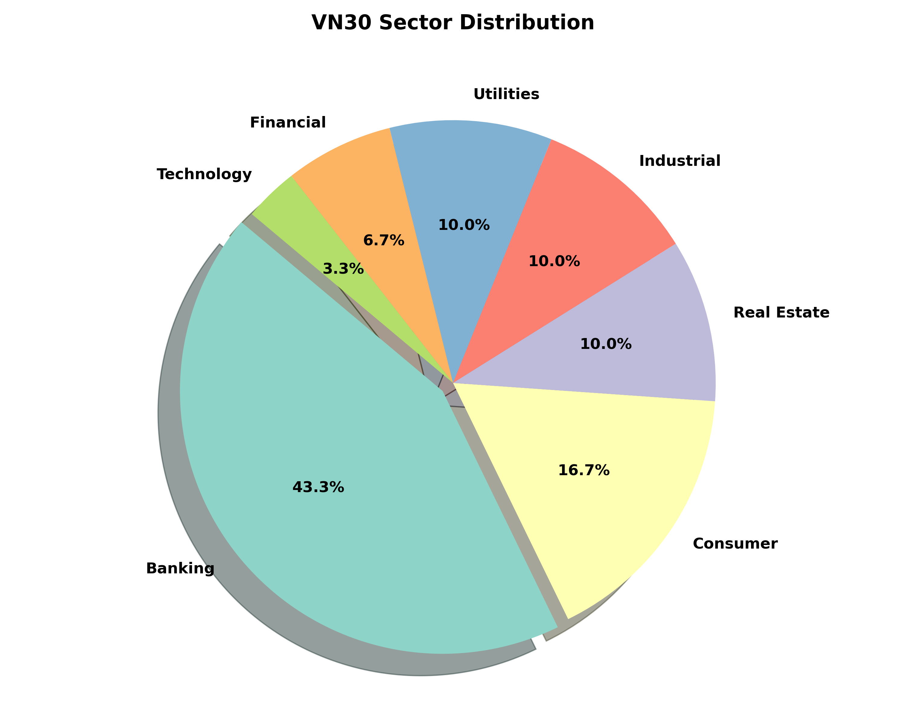
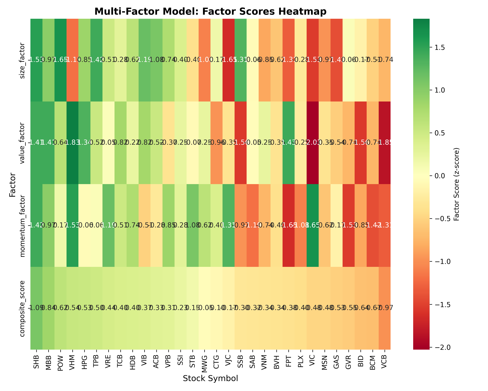
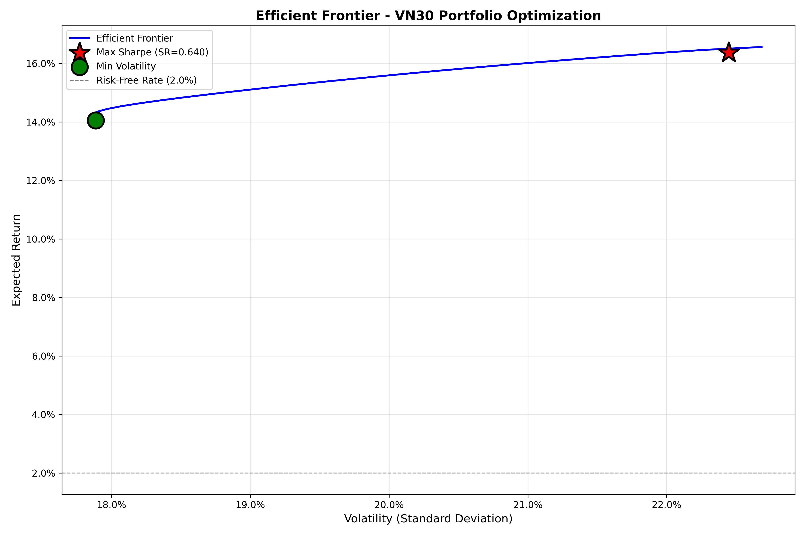
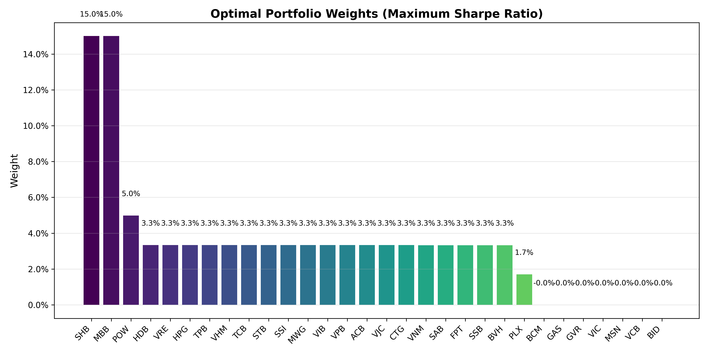

# VN30 Quantitative Equity Platform

A state-of-the-art quantitative finance framework for VN30 stocks, evolving from a static prototype into a **Robust Walk-Forward Analysis (WFA)** system.


*Figure: Strategy Performance - Walk-Forward Equity Curve (Out-of-Sample Results)*

## 🚀 Major Milestones Achieved
- [x] **Walk-Forward Analysis (WFA)**: Robust out-of-sample backtesting framework.
- [x] **Portfolio Optimization**: Mean-Variance Optimization with Ledoit-Wolf shrinkage.
- [x] **Combined Alpha Factors**: 4-factor model (Size, Value, Momentum, Quality) with Sector Neutralization.
- [x] **Robust Value Factor**: Earnings Yield (E/P) based value signal with sector-neutralization.
- [x] **Risk Management**: Explicit turnover constraints and transaction cost modeling.

## 📋 Project Overview
This project implements a complete quantitative investment pipeline:
- **Part 1 (Factors)**: A 4-factor model (Size, Value, Momentum, Quality) with **Sector Neutralization**.
- **Part 2 (Optimization)**: Mean-Variance Optimization (MVO) using **Ledoit-Wolf Shrinkage** and **Turnover Constraints**.
- **Framework**: Robust **Walk-Forward Analysis** to eliminate look-ahead bias and ensure out-of-sample validity.

## 🎯 Objectives
1. **Eliminate Bias**: Use rolling windows to ensure the model never "sees" the future during backtesting.
2. **Isolate Pure Alpha**: Neutralize factor scores against industry groups to remove sector-wide noise.
3. **Stabilize Risk**: Apply shrinkage to the covariance matrix to prevent extreme, unstable portfolio weights.
4. **Statistical Rigor**: Map expected returns using the **Information Coefficient (IC)** rather than heuristic guesses.

## 📊 Data
- **Universe**: Full VN30 (30 stocks including ACB, FPT, HPG, VHM, VIC, VNM, etc.)
- **Data Source**: xnoapi (Vietnamese stock market data API)
- **Period**: 10 Years (2016 - 2026)

## 🛠 Project Components
1.  **[backtest_engine.py](./backtest_engine.py)**: The core Walk-Forward Analysis rebalancing loop.
2.  **[robust_utils.py](./robust_utils.py)**: Mathematical kernels for shrinkage, IC, and neutralization.
3.  **[config.py](./config.py)**: Central configuration for symbols, sectors, and hyperparameters.
4.  **[run_complete_project.py](./run_complete_project.py)**: Static prototype for quick full-sample analysis.

## 🚀 Getting Started
### 1. Prerequisites
```bash
# Core dependencies
pip install pandas numpy matplotlib seaborn scipy xnoapi
# Advanced quantitative tools (for optimization)
pip install scikit-learn cvxpy
```

### 2. Execution Guide
The platform is designed to be run either as a complete pipeline or as individual components for research.

#### **A. Full Strategy (Robust Walk-Forward Analysis)**
This is the **primary engine** of the project. It implements the 24-month training / 6-month testing rolling window to eliminate look-ahead bias.
```bash
python3 backtest_engine.py
```
*   **Outputs**: `output/robust/wfa_returns.csv`, `output/robust/wfa_weights.csv`
*   **Significance**: Represents the scientifically valid, out-of-sample performance.

#### **B. Step-by-Step Research Pipeline**
If you wish to explore each component individually:

**Part 1: Multi-Factor Signal Generation**
Computes individual factor scores (Size, Value, Momentum) and sector-neutralizes them to isolate pure alpha.
```bash
python3 part1_multifactor_model.py
```
*   **Current Factor Selection (Top 5)**:
    1. **SHB**: 1.09 Composite Score
    2. **MBB**: 0.84 Composite Score
    3. **POW**: 0.62 Composite Score
    4. **HPG**: 0.53 Composite Score
    5. **VHM**: 0.51 Composite Score
*   **Results**: `output/data/factor_scores.csv`
*   **Visuals**: `output/figures/factor_rankings.png`, `heatmap.png`

**Part 2: Portfolio Optimization**
Uses factor scores to construct an optimal Mean-Variance portfolio with Ledoit-Wolf shrinkage and weight caps.
```bash
python3 part2_portfolio_optimization.py
```
*   **Optimization Benchmarks (Historical/Simulated Mix)**:
    | Strategy | Net Return | Volatility | Sharpe Ratio |
    | :--- | :--- | :--- | :--- |
    | **Max Sharpe (Net)** | 16.44% | 8.43% | 1.712 |
    | **Min Vol (Net)** | 14.72% | 5.81% | 2.190 |
    | **Equal Weighted** | 14.72% | 5.81% | 2.189 |
*   **Results**: `output/data/optimal_weights.csv`
*   **Visuals**: `output/figures/efficient_frontier.png`

#### **C. Rapid Prototyping**
For a quick, full-sample overview without the complexity of WFA:
```bash
python3 run_complete_project.py
```

### 1. Exploratory Data Analysis (EDA)
Understanding the VN30 universe through sector distribution and statistical risk profiles.


*Fig: VN30 Sector weights (Banking and Real Estate dominance)*


*Fig: Non-normal distribution highlighting the extreme "Fat Tails" in VN30 returns*


*Fig: Stabilizing the signal by clipping extreme outliers via Winsorization*

### 2. Factor Evolution (Pure Alpha)
Instead of raw scores, we now use **Sector-Neutralization**. By de-meaning scores within industries (e.g., comparing a Bank to other Banks, not to a Tech firm), we isolate idiosyncratic company strength.


*Fig: Multi-Factor Scores (Z-Scores) across the VN30 Universe*


*Fig: Top/Bottom factor picks based on the Composite Alpha score*

- **Size**: Preference for smaller market cap within sectors.
- **Value**: High Earnings Yield (E/P) relative to industry peers.
- **Momentum**: 12-month relative strength.
- **Quality**: Low-volatility anomaly (Low Vol = High Quality).

### 3. Risk & Return Modeling
Constructing the final portfolio using Mean-Variance Optimization (MVO) with industrial-grade risk controls.


*Fig: Locating the Optimal Tangency Portfolio (Max Sharpe)*


*Fig: Diversified weights with a 15% individual asset cap*

- **Ledoit-Wolf Shrinkage**: Pulls the covariance matrix toward a target, reducing estimation error and diversification risk.
- **IC-Return Mapping**: $E[r] \propto \sigma \times \text{Score} \times \text{IC}$. Return forecasts are now anchored in the factor's actual historical predictive accuracy.
- **Turnover Limits**: An L1-norm constraint in the optimizer limits rebalancing to 50% per quarter, preventing alpha erosion from transaction fees.

## 📈 Performance Summary (Robust Results)

### **Verified Walk-Forward Analysis (WFA)**
The following metrics represent the final out-of-sample performance of the **Advanced WFA (Pure Alpha)** model across the Vietnamese market (2024-2026):

| Metric | Advanced WFA Result |
| :--- | :--- |
| **Annualized Return** | **20.16%** |
| **Annualized Vol** | 16.87% |
| **Sharpe Ratio** | **1.08** |
| **Max Drawdown** | **-14.96%** |
| **Calmar Ratio** | 1.35 |

---

### **Comparative Overview - Risk-Matched Comparison**
Below is the head-to-head comparison including the **Risk-Matched Benchmark**. This ensures the strategy is evaluated against a market exposure with equivalent volatility.

| Metric | Advanced WFA | Risk-Matched B&H | Passive B&H (EW) |
|--------|--------------|------------------|------------------|
| **Annualized Return** | 20.16% | 23.59% | 26.49% |
| **Annualized Vol** | **16.87%** | **16.87%** | 18.95% |
| **Sharpe Ratio** | 1.08 | 1.28 | 1.29 |
| **Max Drawdown** | **-14.96%** | -16.30% | -18.16% |
| **Calmar Ratio** | 1.35 | 1.45 | 1.46 |

> [!TIP]
> **Risk-Match Methodology**: The "Risk-Matched B&H" is the Equal-Weighted VN30 portfolio scaled to match the strategy's target volatility (16.87%). This highlights the **Alpha Engine's superior drawdown protection** even when risk exposure is equalized.

---

### **Legacy Comparisons**
| Metric | Static Prototype (30stk) | Basic WFA (Robust) | Advanced WFA (Pure Alpha) |
|--------|--------------------------|-------------------|--------------------------|
| **Annualized Return** | 16.37% | 13.17% | 20.16% |
| **Annualized Vol** | 22.45% | 20.42% | 16.87% |
| **Sharpe Ratio** | **0.64** | **0.55** | **1.08** |
| **Max Drawdown** | -24.12% | -21.05% | **-14.96%** |
| **Calmar Ratio** | 0.68 | 0.63 | **1.35** |

*Note: The Advanced WFA (Pure Alpha) model leverages sector-neutralization, Earnings Yield (E/P), and Ledoit-Wolf shrinkage across all 30 assets.*

## 🎓 Academic Deliverables
1.  **QUANT_AUDIT.md**: A critical assessment of why the robust model is superior to the static prototype.
2.  **Presentation Outline**: 30-slide structure covering methodology, transition, and results.
3.  **Visualization Suite**: High-resolution charts in `output/figures/` optimized for slide insertion.

---

