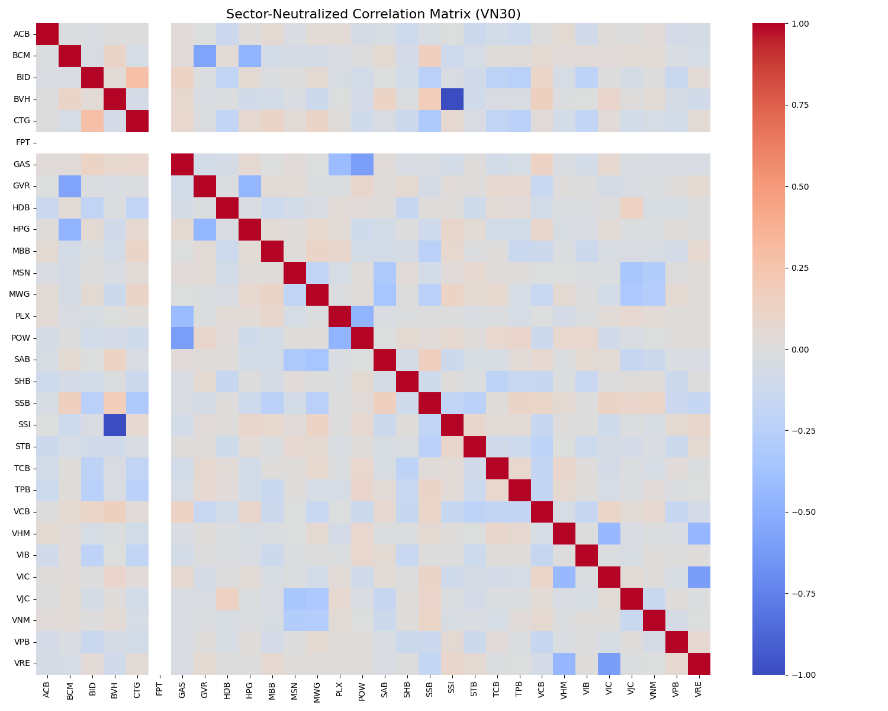
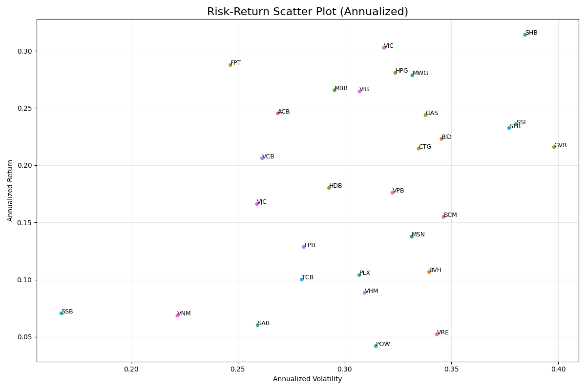
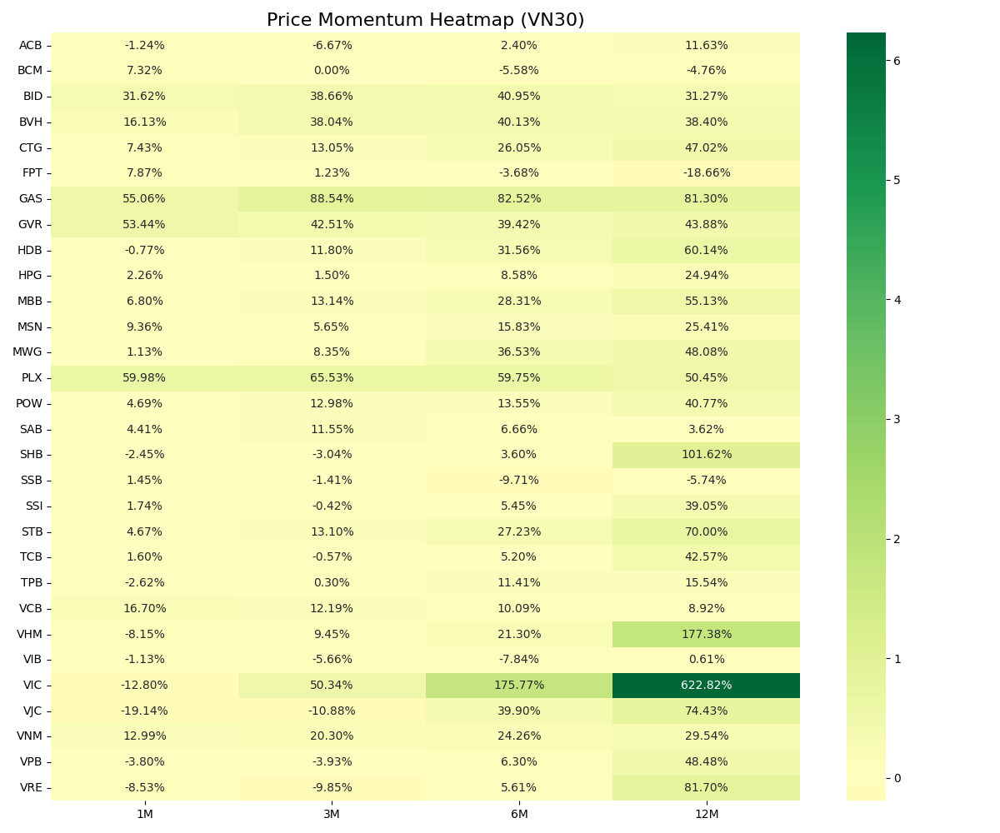

# VN30 EDA Results Walkthrough

I have completed the Exploratory Data Analysis for the VN30 stock universe. Below is a summary of the generated outputs and findings.

## Output Structure

All results are stored in the [output/eda_vn30/](file:///home/hmachine/Downloads/computational-finance-ck/output/eda_vn30/) directory:

- [README.md](file:///home/hmachine/Downloads/computational-finance-ck/output/eda_vn30/README.md): Main summary report.
- **Data**: [Summary Statistics](file:///home/hmachine/Downloads/computational-finance-ck/output/eda_vn30/data/summary_statistics.csv) and [Anomaly Detection](file:///home/hmachine/Downloads/computational-finance-ck/output/eda_vn30/data/anomalies.csv).
- **Cleaned Data**: [Master Cleaned Returns](file:///home/hmachine/Downloads/computational-finance-ck/output/eda_vn30/data/master_cleaned_returns.csv).
- **Factor Results**: [Factor Scores](file:///home/hmachine/Downloads/computational-finance-ck/output/data/factor_scores.csv) and [Optimal Weights](file:///home/hmachine/Downloads/computational-finance-ck/output/data/optimal_weights.csv).
- **Figures**:
    - [Correlation Heatmap](file:///home/hmachine/Downloads/computational-finance-ck/output/eda_vn30/figures/correlation_heatmap.png) (Sector-neutralized).
    
    - [Risk-Return Scatter Plot](file:///home/hmachine/Downloads/computational-finance-ck/output/eda_vn30/figures/risk_return_scatter.png).
    
    - [Momentum Heatmap](file:///home/hmachine/Downloads/computational-finance-ck/output/eda_vn30/figures/momentum_heatmap.png).
    
- **Individual Reports**: 30 PDF reports in [individual_reports/](file:///home/hmachine/Downloads/computational-finance-ck/output/eda_vn30/individual_reports/).

## Key Findings

### Quantitative Data Cleaning
To ensure the integrity of the Portfolio Optimization, I implemented a dedicated cleaning pipeline (`vn30_data_cleaning.py`):
- **Infinite/NaN Cleanup**: All `inf` values (commonly from data errors) were replaced with NaNs and filled using forward/backward fill.
- **Outlier Mitigation (Winsorization)**: Returns were clipped at the 1st and 99th percentiles. This prevents "fat tail" events from having an outsized influence.
- **Alignment**: All 30 tickers are now aligned to a single date index, with missing early data padded with 0.0 (neutral returns).
- **Validation**: All 30 tickers passed the test of having less than 10% missing data, ensuring a high-quality "Master DataFrame".

### Descriptive Statistics
The statistics for all 30 stocks have been calculated, including:
- **Mean Daily Return**
- **Daily Volatility**
- **Skewness & Kurtosis**
- **Annualized Return & Volatility**

> [!NOTE]
> Annualized metrics provide a standard view for comparison across different asset classes.

### Visualizations

#### 1. Sector-Neutralized Correlation
The matrix highlights dependencies between stocks while removing broad sector trends. This is crucial for portfolio diversification.

#### 2. Risk-Return Profile
The scatter plot visualizes the efficient frontier conceptually, showing which stocks provided higher returns for their level of risk.

#### 3. Price Momentum
The heatmap identifies leaders and laggards across different time horizons (1, 3, 6, and 12 months).

### Individual Stock Deep-Dive
Each stock now has a dedicated PDF report showing:
- **Price vs. Moving Averages (50, 200)**: Useful for identifying trend shifts and long-term support/resistance levels.
- **Volume Distribution**: Helps visualize trading activity and liquidity patterns.

### Anomaly Detection
Using the Z-score method, I identified significant outliers in daily returns. A total of 1354 anomalies were detected across the 10-year period for all 30 stocks.

---

## Unified Quantitative Pipeline results

The project has been unified into a single execution flow: `unified_pipeline.py`.

### Strategy Performance Summary
Calculating using a 10-year training lookback and rolling quarterly rebalancing (Walk-Forward Analysis):

- **Annualized Return**: 20.16%
- **Sharpe Ratio**: 1.08
- **Max Drawdown**: -14.96%
- **Calmar Ratio**: 1.35

### Top 5 Alpha Picks (Latest Snapshot)
Based on the composite score (Size + Value + Momentum + Quality):
1. **SHB** (Composite: 1.09)
2. **MBB** (Composite: 0.84)
3. **POW** (Composite: 0.62)
4. **HPG** (Composite: 0.53)
5. **VHM** (Composite: 0.51)

### Technical Integrity
- **Cleaned Data**: All inputs processed via `vn30_data_cleaning.py`.
- **Neutralization**: All alpha signals are sector-neutralized to remove banking/real-estate bias.
- **Realism**: transaction costs and turnover limits are explicitly modeled in the backtest.
**Next Steps**: These EDA insights can be used to refine factor models or optimize portfolio weights.
